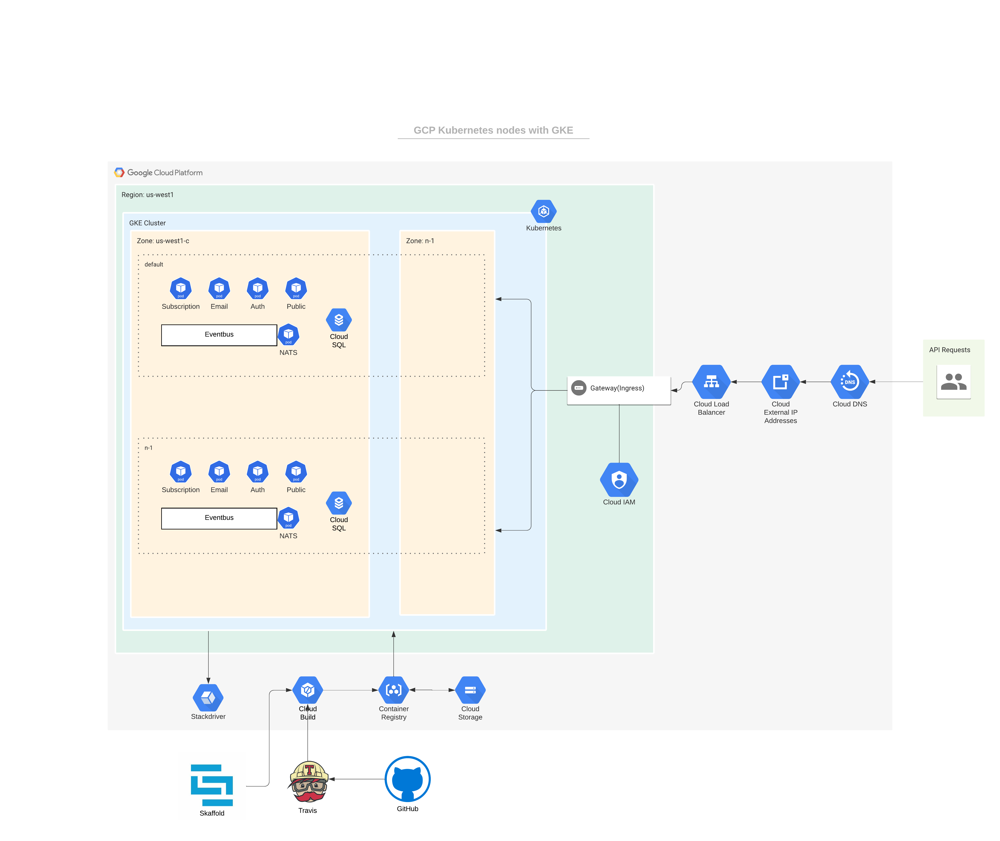

=================
Architecture diagram
=================

Description of the GCP tools used in production

Tools and Specs
----------------
* GKE cluster - 1: adidasttestcluster
* Nodes(compute engine) - 1(due to high cost): gke-adidasttestcluster-default-pool-28f2aa9d-8hh1 with 2CPUs and 3GB
* Pods - 5(one per service and eventbus)
* Google cloud build. Triggers a build when code is pushed through skaffold or a build pipeline
* Google container registry. Manage Docker images, perform vulnerability analysis
* Google cloud sql - 1: adidas-testdb-instance with 2 CPUs and 4GB
* Google cloud storage. For storing the built images(can be used to store files if need be)
* Google stack driver
* Google cloud iam
* Google load balancer
* Google cloud external IP addresses
* Google cloud DNS

